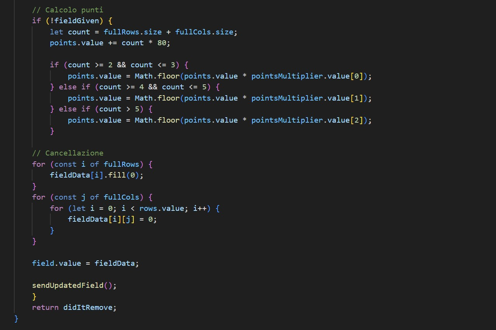

# Docs

*Romagnoli, Petrino - 5F ITT Blaise Pascal*

## Introduzione

Questo documento fornisce una panoramica tecnica e stilista del progetto "Bust-a-Bloq", un applicativo sviluppato utilizzando Vue.js come framework e le capacità grafiche della libreria Javascript Pixi.js.

## Tecnologie utilizzate
- Vue.js: framework HTML e Javascript usato per la creazione delle pagine web del sito
- Pixi.js: libreria grafica Javascript usata per visualizzare il campo di gioco
- Websocket: usati per trasmettere lo stato della partita e le varie richieste real-time al server
- Firebase: usato per le funzionalità di login e come database

## Feature programmate
- [x] Campo di gioco
- [ ] Menù principale
- [x] AI generazione blocchi
- [x] Multiplayer
- [ ] Lista Amici
- [x] Partite private
- [ ] Inviti alle partite
- [x] Pelli per i blocchi
- [ ] Pagina about

## Struttura del codice

Il progetto è stato creato utilizzando l'architettura fornita da Vue.js, sfruttando sia componenti che view offerte dal framework stesso e, in aggiunta ad esse, usando un sistema di stores offerto da Pinia per gestire lo stato corrente della partita.
Le texture dei vari blocchi di gioco sono salvate in locale, ma non è impossibile pensare ad un espansione futura con l'utilizzo di un database non-relazionale.

## Funzionalità
- **Campo di gioco:** Il campo di gioco deve adattarsi alle dimensioni dello schermo.
- **Generazione blocchi con AI:** Il sistema deve riconoscere quali blocchi possono adattarsi allo tato attuale della partita, permettendo al giocatore di progredire.
- **Multiplayer:** Il gioco offre funzionalità multiplayer per partite 1 contro 1 o con molteplici giocatori.
- **Lista Amici:** Il gioco permette di avere una lista di amici per facilitare l'invito a delle partite amichevoli o chattare.
- **Partite private:** Possibilità di creare lobby personalizzate per partite organizzate con amici oppure tornei.
- **Inviti alle partite:** Si possono invitare altri giocatori ad una lobby tramite un codice/link.
- **Pelli per i blocchi:** Capacità di sbloccare nuovi aspetti per i blocchi ed il campo di gioco aumentando di livello.

## Descrizione gioco
*Inserire screenshot del gioco (quando abbiamo implementato il campo)*

### In cosa consiste il gioco?
*Inserire qui nome gioco in WIP* è un gioco che consiste nell'eliminare il maggior numero di blocchi possibile dal campo di gioco senza rimanere senza spazio per inserirne di nuovi.

### Come si eliminano i blocchi?
Per distruggere i vari blocchi dal campo di gioco, bisogna formare una linea (Orizzontale o verticale) di blocchi che vada da un lato all'altro del campo. Fare ciò distruggerà tutti i blocchi appartenenti a quella linea. In caso si elimini più di una linea con un blocco solo si accumuleranno punti extra.

### Che tipologie di blocchi esistono?
Al contrario di altre tipologie di giochi simile (*es. Tetris*), i blocchi di (*Inserire WIP*) non sono generati in maniera casuale, ma vengono invece adattati per permettere sempre al giocatore di avanzare nella partita se è in grado di individuare la combinazione di blocchi giusta per proseguire. I blocchi sono di svariate forme e non sono limitati ad uno specifico numero di quadretti.

## Potenziali miglioramenti
- Vorremmo che il gioco possa essere il più fluido e soddisfacente possibile, offrendo al giocatore delle animazioni fluide che possano miglioare l'esperienza del giocatore, fornendo informazioni chiare sullo stato della partità.

- Classifiche online basate sulla regione di gioco e classifiche contenenti solo gli amici del giocatore, in modo da confrontare indirettamente i traguardi conseguiti durante le partite.

- Possibilità di accesso utilizzando Social Media, per permettere un Login più veloce per iniziare a giocare subito con altre persone online, magari conservando alcune caratteristiche del profilo come la posizione in classifica e gli aspetti dei blocchi ottenuti.

- Implementazione di un sistema di ricompense, ottenibili raggiungendo delle 'Milestones' segnate dal sistema di punteggio. Queste ricompense includono perlopiù gli aspetti dei blocchi.

- Inserire opzioni per regolare il volume di effetti e musica del gioco in separazione.

## Immagini del gioco

  #### Qualche esempio di partite

  

  

  #### Partita persa

  

## Spiegazione codice

- Creazione della pagina home, con l'inserimento del componente GameField (che visualizza il campo di gioco) e alcuni componenti di debug ([HomeView.vue](../src/views/HomeView.vue))

  

- View del campo di gioco, creiamo un div con un riferimento a gameContainer, nel quale verrà visualizzato il gioco, e impostiamo due eventi per creare e per resettare il gioco quando il componente viene ricaricato ([GameField.vue](../src/components/GameField.vue))

  

- Navbar del sito, aggiungiamo icone e link alle altre pagine ([Navbar.vue](../src/components/Navbar.vue))

  

- Le texture assegnate ai blocchi sono totalmente originali e richiamano le ambientazioni degli iconici film di Bud Spencer e Terence Hill, ma sono in grado di essere cambiate con altre tramite un apposito menù.

[Inserire immagine]

- Creazione di un modal (una finestra pop-up) per permettere il login e la registrazione al sito, con input dei dati e bottoni per scegliere l'azione ([Navbar.vue](../src/components/Navbar.vue))

  

- Inizializzazione delle variabili per il render grafico, calcoliamo la posizione del campo, impostiamo la grandezza dei blocchi e il numero di texture disponibili, infine inizializziamo l'app e impostiamo un watcher per permettere il reset del gioco ([Graphics.js](../src/scripts/graphics.js))

  

- Metodo per caricare le texture e renderle disponibili all'utilizzo ([Graphics.js](../src/scripts/graphics.js))

  

- Metodo per renderizzare il campo di gioco, dispone di due modalità: una usa il campo del giocatore, l'altra quello dell'avversario. Scorre la matrice del campo, crea uno sprite per ogni blocco, gli assegna una texture e imposta le coordinate ([Graphics.js](../src/scripts/graphics.js))

  

- Metodo che viene eseguito ogni frame, fa il render dell'intero gioco, imposta i gli eventi e aggiunge il titolo, il campo di gioco e i pezzi successivi ([Graphics.js](../src/scripts/graphics.js))

  

- In più il metodo aggiunge anche il contatore dei punti, il bottone di reset e due watcher per aggiornare i punti e il campo dell'avversario ([Graphics.js](../src/scripts/graphics.js))

  

- Inazializzazione delle variabili necessarie al render dei pezzi successivi, creiamo l'oggetto, i suoi eventi e gli assegnamo una texture casuale ([Graphics.js](../src/scripts/graphics.js))

  

- Assegnazione delle coordinate al pezzo appena creato e aggiunta al container

  

- Metodi per aggiornare le view del giocatore e del suo avversario: rimuovono i container, li aggiornano e li riposizionano nell'app ([Graphics.js](../src/scripts/graphics.js))

  

- Metodi per connettersi e disconnettersi al server web socket per permettere la funzionalità multigiocatore, con appropriati metodi di callback per gestire i vari esiti ([Multiplayer.js](../src/scripts/multiplayer.js))

  

- Metodi fetch per reperire i dati di un certo utente e per fare il login. Se il login avviene con successo l'app si connette automaticamente al server WebSockets per abilitare la funzionalità multigiocatore ([Multiplayer.js](../src/scripts/multiplayer.js))

  

- Import delle librerie e inizializzazione delle variabili nel server

  

- Creazione della matrice in grado di visualizzare il campo di gioco tramite metodi in graphics.js (come getFieldGraphics()). Questa variabile ci aiuterà a capire quali spazi nella board sono occupati e quali tipi di texture utilizzano. Ogni numero diverso da 0 indica una texture diversa.
  
  

- Creazione del lo store di Pinia usato per gestire lo stato dell'applicazione, oltre che una variabile "blocks" contenente tutti i tipi possibili di blocco che il giocatore può ottenere durante la partita.
  
  

- Inizializzazione delle variabili che determinano la larghezza e lungezza del campo, oltre che il metodo per caricare il campo d'esempio all'interno della nuova variabile "field" creata. In questo modo riusciamo agilmente a lavorare sul campo da gioco tramite tutte le sue varie proprietà.
  
  

- Funzione che fornisce al giocatore 3 pezzi casuali tra quelli all'interno della variabile "blocks" con una texture casuale. Questi pezzi saranno forniti al giocatore e potrà inserirli nel campo di gioco a suo piacimento.
  
  

- Oltre alla funzione sopra citata, il gioco è anche in grado di generare pezzi che si adattano al campo di gioco corrente, permettendo al giocatore di poter avanzare all'interno della partita senza che esso rimanga bloccato. 

  

- Inoltre, questa stessa funzione sceglie randomicamente se dare al giocatore un pezzo "migliore", ovvero uno che riempie una riga o una colonna, oppure uno "normale", ovvero un pezzo che entra nel campo di gioco e basta. Questo è per lasciare al giocatore una comunque alta possibilità di avanzare all'interno della partita senza però rendere il gioco monotono.

  

- Funzione che controlla se un pezzo è in grado o no di entrare nel campo di gioco, utile per controlli interni e calcolare quali sono i pezzi migliori da dare al giocatore. Esso controlla
tutte le posizioni possibili con le quali il pezzo può entrare e si assicura se sia un miglior pezzo o no.

  

- Questa funzione invece, è in grado di verificare se un determinato blocco è un "miglior pezzo", ovvero è sia in grado di entrare nel campo corrente, sia è capace di eliminare una riga oppure una colonna se piazzato in una determinata maniera.

  

- Il metodo clearLines invece, ha una duplice funzione: O è in grado di rilevare se il giocarore ha completato una riga o una colonna per eliminarla, o può essere utilizzato per testare se, con una determinata disposizione del campo che gli verrà fornita in input, si è completata una riga o una colonna. Utile per capire quali sono i blocchi migliori da fornire al giocatore.

  

- Questo stesso metodo è anche in grado di assegnare dei punti al giocatore in base a quante righe o colonne ha distrutto, per poi aggiornare il campo da gioco con le linee eliminate.

  

- Funzione che, cliccando un apposito bottone posto in alto a sinistra della schermata di gioco, è in grado di resettare lo stato della partita e i punti ottenuti dal giocatore finora, generando nuovi pezzi da dare al giocatore.

  

- Funzione che viene chiamata ogni volta che viene piazzato un blocco e controlla se il giocatore sia in grado o no di continuare la partita. In caso il giocatore sia rimasto bloccato, il metodo ritornerà true e il campo di gioco verra resettato.

  

- Funzione che assicura il login al giocatore e gli permette di visualizzare il nome utente.

  

- Altri metodi utili per recuperare informazioni sul profilo e, soprattutto, recuperare il campo del giocatore avversario per visualizzare i suoi progressi.

  